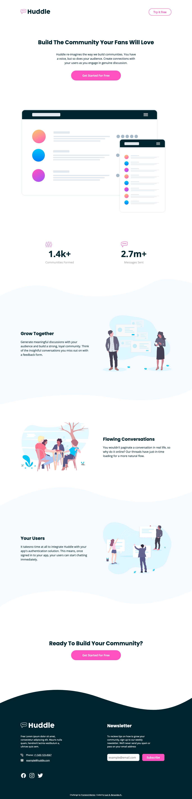
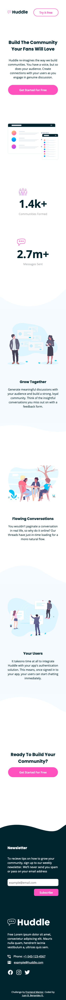

# Frontend Mentor - Huddle landing page with curved sections solution

This is a solution to the [Huddle landing page with curved sections challenge on Frontend Mentor](https://www.frontendmentor.io/challenges/huddle-landing-page-with-curved-sections-5ca5ecd01e82137ec91a50f2). Frontend Mentor challenges help you improve your coding skills by building realistic projects.

I selected this as a simple challenge of a landing page which allowed me to practice ways in which to structure my css by using namespaces and utility classes.

## Table of contents

- [Overview](#overview)
  - [The challenge](#the-challenge)
  - [Screenshot](#screenshot)
  - [Links](#links)
- [My process](#my-process)
  - [Built with](#built-with)
  - [What I learned](#what-i-learned)
  - [Continued development](#continued-development)
- [Author](#author)

## Overview

### The challenge

Users should be able to:

- View the optimal layout for the site depending on their device's screen size
- See hover states for all interactive elements on the page

### Screenshot

### Links

- Solution URL: [Solution URL here](https://github.com/jbbenavidesr/fem-challenge-huddle-landing-curved-sections)
- Live Site URL: [Live site URL here](https://jbbenavidesr.github.io/fem-challenge-huddle-landing-curved-sections/)

## My process

### Built with

- Semantic HTML5 markup
- CSS custom properties
- Flexbox
- Mobile-first workflow

### What I learned

My main focus in this challenge was first to build it fast cause I want to improve my workflow and speed when starting new projects. Second, the approach I took. I am working in embracing the way CSS works and using the cascade instead of fearing it. This approach took many concepts that I learned in Kevin Powell's [Css Demystified course](https://cssdemystified.com/) and try to focus in a semantic markup and a solid reusable css that is not that long.

The curved sections where an interesting challenge that I tried to approach first using `clip-path`, but that approach made it difficult to keep the shape in sizes different than the ones given cause instead of resizing the path it just cutted it in smaller sizes and left it half in bigger sizes. Finally I decided the best approach was with background images in pseudoelements.

### Continued development

In the future I would like to improve my approach to utility classes. I want to use them for some general things like the ones I did but without falling into a full utility approach, but more of the sort of the CUBE CSS approach which is the approach I'm looking forward to implement. I guess I'll slowly build some general utilities that I can just bring at the beginning of each project.

Finally, the namespacing I used for components was a great for nesting so I want to get better with Sass fot this.

## Author

- Github - [Juan Bernardo Benavides](https://github.com/jbbenavidesr)
- Frontend Mentor - [@jbbenavidesr](https://www.frontendmentor.io/profile/jbbenavidesr)
